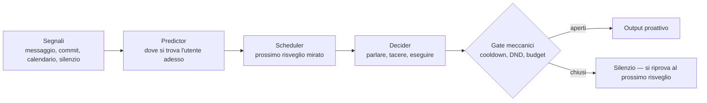

# 02. Architettura cognitiva

> I sei pilastri funzionali, l'*awareness loop* che sostituisce i tick periodici, la *cognitive transparency* che rende il modello consapevole del proprio stato interno, e il primo strato dell'*executive* — skill come programmi con piano fisso, e bozza-da-confermare per tutto ciò che esce verso terzi.

---

## I sei pilastri

Qualsiasi agente AI sufficientemente maturo finisce per avere sei pilastri funzionali. Non perché un'autorità centrale li abbia decretati, ma perché ognuno risolve un problema che emerge naturalmente quando il sistema cresce. Ricerca empirica recente (HyperAgents) ha mostrato che un agente lasciato a self-improve li reinventa da zero. Sono coordinate, non assi arbitrari.

Muffin organizza il proprio design intorno a questi sei.

### 1. Tool — la capacità di agire

Cosa risolve: trasformare un modello di linguaggio in un'entità che può fare cose nel mondo (leggere uno stato, scrivere un fatto, mandare un messaggio, interrogare un calendario, in futuro eseguire un comando su un dispositivo domestico quando l'utente lo chiede).

Come Muffin lo affronta: ogni capability è esposta come tool con descrizione orientata all'uso (*quando chiamarlo*, *cosa fa*, *cosa restituisce*). I tool sono organizzati in zone di permesso (*green* — esegui subito, *yellow* — conferma in batch, *red* — conferma esplicita, *outward* — l'azione raggiunge un terzo a nome dell'utente e nasce sempre come bozza da confermare) calibrate sul *blast radius* dell'azione. Le letture sono sempre verdi; le scritture su risorse esterne irreversibili sono sempre rosse; quello che esce verso altre persone — una mail, un invito — non parte mai senza che l'utente abbia visto e approvato esattamente cosa sta per uscire.

### 2. Memoria — la continuità nel tempo

Cosa risolve: ricordare *cosa è stato* e *cosa significa*, in modo che la conversazione di oggi sia informata da quella di tre mesi fa.

Come Muffin lo affronta: un modello a layer (vedi [Sistema di memoria](03-memoria.md)) che separa episodi grezzi (substrato sacro), entity graph (modello del mondo), strato riflessivo (osservazioni, pattern, narrative) con confidence esplicita.

### 3. Contesto — cosa attentamente considerare

Cosa risolve: il modello ha una finestra di attenzione finita. Se gli si dà tutto, non focalizza nulla. Il pilastro contesto decide *cosa entra in quella finestra in questo momento*.

Come Muffin lo affronta: retrieval ibrido (vettoriale + keyword + grafo) per la memoria semantica, decay temporale per favorire materiale recente, segnali di rilevanza calcolati prima della chiamata al modello. Il principio: il modello non deve cercare il contesto, deve trovarlo già lì.

### 4. Pianificazione — la proattività con intelligenza

Cosa risolve: il modello reagisce bene a stimoli, ma per essere utile deve anche *iniziare* azioni — quando notare qualcosa, quando svegliarsi, quando proporre.

Come Muffin lo affronta: l'*awareness loop* (sotto), che non è un cron periodico ma un sistema che decide *quando* svegliarsi in base allo stato corrente dell'utente, e gate meccanici che limitano *quando* può parlare proattivamente. Per le azioni a più passi, il piano non viene improvvisato dal modello a runtime — vive in *skill* con sequenza fissa decisa in fase di authoring (vedi §Agire, sotto).

### 5. Verifica — il controllo sull'output

Cosa risolve: i modelli generano fluentemente cose vere e cose false con la stessa confidenza apparente. Senza verifica, ogni claim è una scommessa.

Come Muffin lo affronta: capitolo dedicato in [Verifica e affidabilità](05-verifica.md). Tre layer di verifica con costo crescente, *confidence* esplicita su ogni claim derivato, name resolution deterministica per nomi propri.

### 6. Modularità — l'evoluzione attraverso ricombinazione

Cosa risolve: i sistemi che non sono modulari diventano impossibili da migliorare a un certo punto. Ogni cambiamento ne rompe altri.

Come Muffin lo affronta: distinzione netta substrato/harness, interfacce stabili tra strati, capacità di sostituire un componente alla volta senza toccare il resto.

---

## L'awareness loop

Il modo classico di rendere un agente "proattivo" è un cron periodico: ogni N minuti il sistema si sveglia, controlla qualche stato, eventualmente fa qualcosa. È semplice e funziona, ma sbaglia il problema.

Il problema non è *"controllare ogni N minuti"*. È *"essere sveglio quando serve, dormire quando non serve"*. Una persona la mattina, mentre fa colazione, non vuole una notifica. La stessa persona, dopo un commit doloroso a tarda sera, potrebbe trarre beneficio da una domanda. Il cron periodico tratta i due momenti uguale; l'*awareness loop* li tratta diversamente.

L'*awareness loop* di Muffin è composto da tre componenti.

### Predictor — la rappresentazione dello stato dell'utente

Mantiene una stima continua di *dove è* la persona osservata: cosa sta facendo, da quando, fino a quando probabilmente continuerà, con che livello di confidence. Lo stato non è un mood astratto — è una rappresentazione operativa del tipo *"sta lavorando su un progetto, probabilmente fino a metà pomeriggio, confidence media"*.

Il predictor si aggiorna su ogni segnale che arriva (un messaggio, un commit, un evento di calendario, una mancanza di attività dopo un orario abituale). Il silenzio è un segnale come gli altri: assenza prolungata di attività osservabile può significare riposo, o concentrazione profonda, o crisi — il predictor distingue in base al contesto.

### Scheduler — il risveglio intelligente

Decide il prossimo momento di risveglio in base a cosa il predictor sta dicendo. Non *"tra 30 minuti"*, ma *"alle 14:30 quando finirà la riunione che ha in calendario"*, *"tra due ore quando probabilmente avrà mandato il primo messaggio della giornata"*, *"a fine giornata quando inizia la finestra in cui di solito riflette"*.

C'è sempre un fallback periodico (un risveglio garantito comunque, anche se nessun trigger specifico è scattato), perché il sistema non può scoprirsi muto se il predictor sbaglia. Ma il default è il risveglio mirato, non quello cronologico.

### Decider — la decisione proattiva

Quando il sistema si sveglia, il decider decide cosa fare: parlare, restare in silenzio, aggiornare lo stato interno, eseguire un task accodato. La decisione passa attraverso *gate meccanici* (vedi sotto) che limitano *quando* il sistema può parlare a prescindere da cosa avrebbe da dire.

Il decider non è un giudice di rilevanza — è un commutatore. La rilevanza è già stata decisa prima dal pipeline di estrazione e dal sistema di salience; il decider applica solo i vincoli operativi.

---

## Gate meccanici vs gate epistemici

Una distinzione operativa importante. *Gate epistemici* sono filtri che decidono *cosa il modello può vedere o considerare* — soglie di rilevanza, threshold di similarità, depth minima per esporre un'osservazione. *Gate meccanici* sono filtri che decidono *quando il modello può agire all'esterno* — cooldown tra messaggi proattivi, fascia oraria *do not disturb*, budget giornaliero di output non richiesto, indisponibilità del predictor.

Muffin tende a:

- **Rimuovere gate epistemici** dove possibile — il modello è meglio del codice nel giudicare cosa è rilevante per una persona specifica, se gli si dà il contesto giusto
- **Tenere gate meccanici severi** — il modello è ottimista sul valore del proprio output, e senza gate meccanici tende a parlare troppo

Ricerca recente (Pare-Bench) ha mostrato empiricamente che i modelli di linguaggio tendono a proporre soluzioni prematuramente in più di tre casi su quattro quando non ci sono vincoli meccanici. È un punto cieco strutturale, non un bug correggibile via prompt — va compensato con codice fuori dal modello.

---

## Cognitive transparency

Un modello che opera *al buio* — senza sapere quali capability ha, in che stato del sistema è, cosa è cambiato di recente — è strutturalmente più fragile di un modello a cui questi segnali sono visibili. Quando il modello sa che è in modalità *do not disturb*, può comportarsi diversamente. Quando sa che il dream cycle ha aggiornato il profilo dell'utente questa notte, può menzionarlo se rilevante. Quando sa che certi termini nel messaggio non sono ancora nel suo vocabolario di entità conosciute, può fermarsi e verificare prima di inventare.

Muffin espone al modello una serie di *segnali ambient* — visibili in ogni turno della conversazione, accanto al messaggio dell'utente, senza che il modello debba fare tool call per ottenerli:

- **Importanza percepita del turno corrente** — calcolata da un sistema di salience deterministico, mostra al modello *"questo turno è normale / sopra la media / particolarmente intenso"*. Aiuta a calibrare profondità di risposta e attivazione di pipeline secondarie.
- **Sintesi di quello che è cambiato di recente nel modello dell'utente** — se il dream cycle ha rigenerato il profilo nelle ultime ore, il modello vede un riassunto delle correzioni e dei nuovi insight. Senza questo, il modello opererebbe come se ogni notte non fosse successo niente.
- **Termini che il modello non riconosce** — quando l'utente menziona un nome proprio nuovo come se fosse condiviso, un sistema deterministico (zero LLM) lo nota e lo segnala al modello come *termine sconosciuto*. Il modello sa che ha un punto cieco e ha un tool dedicato per chiuderlo.
- **Working memory della conversazione corrente** — gli ultimi pochi turni del thread in corso sono iniettati esplicitamente come blocco di prima classe in coda al contesto, dove l'attenzione effettiva del modello è più alta. È l'anchor che impedisce al modello di rispondere a *"sì, esatto"* o *"così come dicevo prima"* riferendosi a materiale recuperato dalla memoria lunga invece che al turno reale dell'utente. Quando il messaggio contiene marcatori deittici (*"questo"*, *"quello"*, *"così"*), un classifier deterministico lo riconosce e *dirotta esplicitamente* il modello dal cercare nella memoria lunga al guardare la working memory.
- **Stato corrente del sistema** — *in modalità do-not-disturb? appena svegliato? finestra di silenzio attiva?* Il modello vede il proprio assetto operativo e si comporta di conseguenza.
- **Tracce delle proprie azioni recenti** — quali tool ha chiamato negli ultimi turni, con che esito. Una forma minima di propriocezione che evita comportamenti come ri-eseguire la stessa azione perché il modello ha *dimenticato* di averla già eseguita.

Il principio: **il modello deve poter introspetterre il proprio funzionamento**, non solo l'input dell'utente. È la differenza tra un agente che reagisce e un agente che si comporta in modo informato.

---

## Il modello come tool-user, non come oracolo

Una scelta di design che permea tutto: Muffin non chiede al modello *"qual è la risposta giusta?"* — chiede *"quali strumenti useresti per arrivare alla risposta giusta?"*. La differenza è importante.

Un oracolo genera dalla sua memoria parametrica e si convince della risposta. Un tool-user dichiara cosa non sa, invoca le capability che riempiono il gap, sintetizza, restituisce. Il primo confabula con disinvoltura; il secondo si ferma e cerca quando non sa.

Muffin è progettato per essere un tool-user. Le tool description sono scritte in modo orientato all'uso (*quando invocare questo*, *cosa cercare prima*), non come reference passiva. Il system prompt incoraggia esplicitamente il modello a fermarsi e verificare di fronte a termini sconosciuti. Il pilastro verifica (di nuovo, capitolo dedicato) ancora questa disposizione con segnali esterni.

L'effetto cumulativo: Muffin sa quando non sa. Per un'AI personale che accumulerà comprensione su una persona per anni, questa è probabilmente la proprietà più importante.

---

## Agire — programmi, non improvvisazione

Dal giugno 2026 Muffin ha il primo strato di un *executive*: la capacità non solo di sapere e dire, ma di fare cose a più passi per conto del proprio utente — organizzare un incontro, preparare una mail. Il design di questo strato segue una distinzione che la ricerca sugli agenti ha reso netta: la differenza tra un *workflow* (sequenza di passi nota in anticipo, eseguita in modo affidabile) e un *agent* (il modello decide i passi strada facendo). Per azioni che toccano il mondo, Muffin sceglie deliberatamente il primo.

Una **skill** è un programma riusabile: una sequenza nominata di passi con *slot tipati* — i buchi da riempire (chi invitare, quando, su che tema). La struttura ha due tempi con requisiti opposti:

- **Authoring** — scrivere una skill nuova è un evento raro che richiede giudizio. Avviene con un modello capace e con supervisione umana: la skill entra nella libreria solo dopo che il suo piano è stato visto e approvato.
- **Execution** — lanciare una skill esistente è frequente e delimitato. Il modello locale non deve inventare il piano (è fisso, deciso all'authoring); deve solo riempire gli slot, attingendo all'entity graph per le informazioni che il sistema già possiede.

La separazione non è un dettaglio di implementazione — è la risposta a un risultato empirico ripetuto: lasciare che un modello di taglia media decomponga un compito a runtime *peggiora* l'affidabilità, anche rispetto allo stesso modello con un piano fisso. L'improvvisazione è il punto debole; l'esecuzione vincolata è il punto di forza. La skill mette l'improvvisazione dove c'è supervisione (authoring) e l'esecuzione dove c'è autonomia (runtime).

Quando una skill produce un'azione che esce verso un terzo — una mail, un invito a una riunione — entra la zona *outward*: l'azione nasce come **bozza**, l'utente vede un'anteprima leggibile di esattamente cosa sta per uscire, e la conferma è il gate. Dopo la conferma c'è ancora una finestra di grazia per annullare, e meccanismi di idempotenza evitano il doppio invio. Il principio dietro è lo stesso del write-on-confirmation della filosofia: *un'entità che agisce verso terzi a nome tuo ha una responsabilità diversa da una che ti parla* — e quella responsabilità non si delega all'ottimismo del modello.

L'orizzonte di questo strato è il punto in cui l'executive incontra lo specchio: *"ho notato che fai spesso questa cosa — vuoi che impari a farla?"*. Le skill non sono un app store; sono una libreria che cresce dall'osservazione della persona. Più Muffin conosce il suo utente, più impara a fare per lui.

---

## Una nota su contesto privato e contesto di gruppo

L'awareness loop, la cognitive transparency e l'apparato di segnali ambient descritti in questo capitolo descrivono il funzionamento di Muffin nel **contesto privato** (1:1 con il proprietario), che è il contesto su cui il sistema è ottimizzato di default. In chat di gruppo, dove Muffin è invitato e partecipa accanto ad altre persone, l'architettura cognitiva è la stessa nella voce e nei sei pilastri, ma le calibrazioni sono diverse: i gate meccanici del Decider sono molto più stretti (niente proattività spontanea, solo on-demand), il pool di memoria interrogabile è limitato a entità con scope condiviso o pubblico, e i segnali ambient personali (living profile, counterpoint, affect signature) non vengono iniettati. La differenza non è di tono — è di *cosa Muffin sa* e *quando si permette di parlare*.
