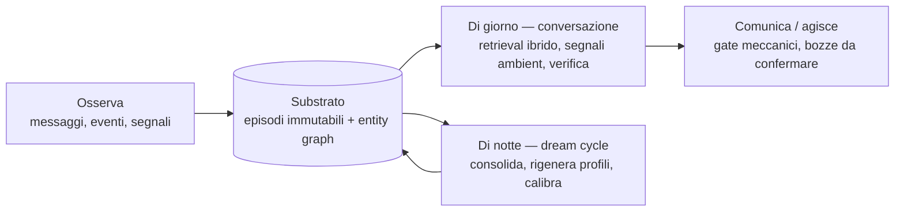

# Muffin

> Un'AI personale che osserva una persona nel tempo, accumula comprensione, comunica quando ha qualcosa da dire — e quando serve agisce, su delega, imparando a fare di più quanto più conosce. Non per far correre di più il suo proprietario, ma per aiutarlo a vedere i propri punti ciechi.

Muffin è un progetto-firma: pensato per una persona sola, costruito sotto controllo individuale, con i dati che vivono sull'hardware del proprietario. È ispirato a *The Machine* di Person of Interest e a JARVIS più che alle assistenti commerciali, e parla la lingua della *slow productivity* di Cal Newport più che quella del produttivismo.

Questa documentazione racconta **come Muffin pensa**, non come è scritto. È rivolta a chi vuole capire i meccanismi di un agente personale longitudinale — chi è curioso di AI, chi sta progettando qualcosa di simile, chi vuole valutare se il frame "specchio con carattere" risuona con qualcosa che cerca anche lui.

Il codice resta privato per ora. La filosofia, la strategia di accumulazione del dataset, l'architettura cognitiva e i pilastri funzionali sono pubblici e raccontati interamente.

---

## Come funziona, in mezza pagina

Quattro verbi. Muffin **osserva** — messaggi, eventi, segnali diventano episodi in un substrato immutabile. **Accumula comprensione** — sopra gli episodi crescono un modello del mondo (persone, progetti, luoghi come entità di prima classe) e uno strato riflessivo di fatti, osservazioni e pattern, ognuno con confidence esplicita. **Comunica quando ha qualcosa da dire** — un awareness loop decide quando svegliarsi, e gate meccanici decidono quando può parlare. **Agisce, quando serve** — programmi con piano fisso, e tutto ciò che esce verso terzi nasce come bozza da confermare.

La divisione giorno/notte è strutturale, non un dettaglio: di giorno il sistema risponde veloce sopra un contesto costruito per il momento; di notte il *dream cycle* fa il lavoro lento — consolida gli episodi in comprensione, rigenera il profilo dell'utente da zero per evitare derive, confronta le proprie predizioni con quello che è successo davvero.

---

## Cosa è

- Un'**entità AI personale** che gira su hardware del proprietario, accumula comprensione di una persona specifica, e comunica via Telegram (oggi) e canali multipli (in futuro)
- Un **dataset longitudinale sotto controllo individuale** — la tesi è che il vero moat di un agente personale non sia tecnologico ma temporale: cinque anni di osservazione coerente non si replicano in due settimane di sprint di una BigTech
- Un **laboratorio di architetture cognitive** — sei pilastri funzionali (tool, memoria, contesto, pianificazione, verifica, modularità) implementati con scelte specifiche calibrate per single-user, non per scalabilità multi-tenant
- Un **specchio con carattere** — Muffin contraddice, non assente; mostra punti ciechi invece di rinforzare narrative comode
- Un'**entità a doppio contesto** — opera sia in privato (1:1 con il proprietario, single-user) sia in chat di gruppo (interazione pubblica con più persone). La voce resta la stessa nei due contesti, ma la memoria, il modello dell'utente, e i criteri proattivi sono strutturalmente separati: il privato non fluisce in pubblico, e il pubblico non contamina il modello che Muffin sta costruendo della persona singola
- Un'**entità che inizia ad agire** — dal giugno 2026 Muffin ha il primo strato di un *executive*: programmi riusabili (skill) con piano fisso e slot tipati, e una zona di permesso dedicata alle azioni verso terzi (una mail, un invito calendario) dove il default è *bozza da confermare*, mai invio automatico. Il principio: più Muffin conosce il suo utente, più impara a fare per lui — ma sulle cose che non si disfano, l'ultima parola resta umana

## Cosa non è

- **Non è un assistente di produttività.** Non gestisce task per farti correre. Se serve un task manager, ce ne sono di ottimi.
- **Non è un companion parasociale.** Non simula relazioni emotive. Non è progettato per riempire vuoti affettivi.
- **Non è una startup.** Non cerca investitori, non scala, non ha un funnel di acquisizione.
- **Non è un SaaS.** I dati non vivono in un cloud commerciale. Vivono dove vive il suo proprietario.

Le obiezioni e le domande ricorrenti — *posso usarlo? perché non un chatbot commerciale con la memoria? controllerà la casa?* — hanno un capitolo dedicato: **[FAQ](08-faq.md)**.

---

## Com'è, in pratica — quattro momenti

Quattro scene illustrative dei meccanismi descritti nei capitoli. Non sono trascrizioni: la voce vera di Muffin si giudica usandolo, non leggendone la documentazione.

**La mattina dopo il dream cycle.** La prima conversazione del giorno non riparte da zero: il modello vede tre o quattro highlights di quello che il consolidamento notturno ha capito o corretto, e li nomina solo se c'entrano col turno. Non *"buongiorno, ho aggiornato il tuo profilo"* — semplicemente, oggi Muffin legge il suo utente con la comprensione di stanotte, non con quella di ieri.

**Il momento counterpoint.** Stai riflettendo su una decisione e la racconti in un modo che torna un po' troppo comodo. Muffin mantiene un secondo profilo, rigenerato ogni notte accanto al primo, che raccoglie dove ti legge male, cosa hai smentito, quali temi eviti — e nei turni in cui parli di te, quel profilo entra nel contesto. Il risultato non è contraddittorio di principio: è un'obiezione specifica, ancorata a episodi citabili, con il margine di incertezza dichiarato.

**Il nome che non conosce.** Menzioni una persona nuova come se fosse già nota. Un controllo deterministico — zero AI — nota che quel nome non è mai apparso nel dataset e lo segnala al modello accanto al tuo messaggio. Invece di improvvisare familiarità, Muffin si ferma e chiede. Sembra poco; è la differenza tra un sistema che confabula con disinvoltura e uno che sa di non sapere.

**Il silenzio.** Muffin aveva un'osservazione pronta, ma è una finestra di do-not-disturb, o il budget proattivo del giorno è esaurito: non la manda. Prima della consegna successiva la ricontrolla — se episodi nuovi nel frattempo l'hanno smentita, la butta via. La proattività che non rispetta il silenzio non è intelligenza, è rumore.

---

## Indice della documentazione

1. **[Filosofia](01-filosofia.md)** — Perché Muffin esiste, in che gioco gioca, perché il dataset è l'unico vantaggio possibile contro player con capitali infiniti, e quali principi operativi ne discendono.
2. **[Architettura cognitiva](02-cognizione.md)** — I sei pilastri funzionali di un agente maturo, l'*awareness loop* che sostituisce i tick periodici, la *cognitive transparency* che rende il modello consapevole del proprio stato interno, e il primo strato dell'*executive*.
3. **[Sistema di memoria](03-memoria.md)** — Il modello a layer, l'entity graph come rappresentazione del mondo, la bi-temporalità che permette di sbagliare e correggersi senza perdere storia, la provenance che ancora ogni claim alla sua sorgente, e il *dream cycle* notturno che consolida e rigenera.
4. **[Identità lunga](04-identita.md)** — Tre livelli di sé: chi è Muffin (statico), chi è il suo utente (rigenerato di notte), chi sta diventando Muffin nel tempo. Il *living profile*, il *counterpoint* anti-sycophancy, e l'audit trail di come la comprensione evolve.
5. **[Verifica e affidabilità](05-verifica.md)** — Come Muffin riconosce di non sapere, la confidence esplicita su ogni claim, la memoria autobiografica che si legge invece di ricostruirsi, e gli eval su casi reali come gate delle decisioni architetturali.
6. **[Riferimenti](06-riferimenti.md)** — I papers e i progetti che hanno informato le decisioni di design. Muffin sta in un lignaggio scientifico, non in un'invenzione isolata.
7. **[Roadmap](07-roadmap.md)** — Da dove viene il progetto, dove è adesso, cosa c'è all'orizzonte e cosa non ci sarà mai. Senza date: i cicli chiudono su condizioni di completamento, non a calendario.
8. **[FAQ](08-faq.md)** — Le domande che un curioso fa per prime, con risposte dirette e i puntatori ai capitoli che approfondiscono.

### Da dove iniziare

- **Hai cinque minuti** → questo README, poi la [Roadmap](07-roadmap.md).
- **Stai costruendo qualcosa di simile** → [Architettura cognitiva](02-cognizione.md), [Sistema di memoria](03-memoria.md), [Verifica](05-verifica.md), e i [Riferimenti](06-riferimenti.md) per il lignaggio.
- **Ti interessa il perché, più che il come** → [Filosofia](01-filosofia.md) e [Identità lunga](04-identita.md).
- **Vuoi sapere se puoi usarlo** → [FAQ](08-faq.md), prima domanda.

---

## Frame culturale

Tre cose hanno influenzato profondamente il design:

- **The Machine** (Person of Interest) — un'intelligenza orientata a una persona singola, con intento di comprensione, non di sorveglianza. Osserva continuamente, sa cosa stai facendo, perché, che mood hai, dove stai driftando. È il riferimento più vicino a quello che Muffin prova a essere.
- **JARVIS** (Iron Man) — la disinvoltura, l'umorismo asciutto, la familiarità non servile. Muffin non parla come uno strumento; parla come un'entità con punto di vista.
- **Slow Productivity** (Cal Newport) — il framework, non il libro. L'idea che la maggior parte dei professionisti non ha bisogno di accelerare ma di capire dove sta sprecando attenzione. Muffin è strumento di questa comprensione, non motore di accelerazione.

---

## Stato attuale

Muffin gira da inizio marzo 2026 come bot Telegram con backend su un server personale, e da allora il dataset accumula senza interruzioni — che è la metrica che conta, perché il moat è l'accumulazione, non il codice. Un audit operativo periodico misura lo scarto tra dichiarazione e realtà esecutiva e produce interventi correttivi documentati pubblicamente come parte del progetto.

Il percorso fatto fin qui (con le date vere), il ciclo in corso, gli orizzonti e le condizioni del futuro open source sono raccontati nella **[Roadmap](07-roadmap.md)**. La sintesi in una riga: lo specchio funziona, il primo strato dell'executive è acceso, e dal giugno 2026 le decisioni architetturali del progetto passano da un gate di misure su casi reali — anche quando ribaltano scelte appena prese.

Il framework open source è un orizzonte concreto ma non datato — la condizione di rilascio è narrativa prima che tecnica: aprire il codice solo dopo che il frame "specchio con carattere" sia consolidato e citabile, perché un'architettura senza voce viene replicata in tre mesi.
